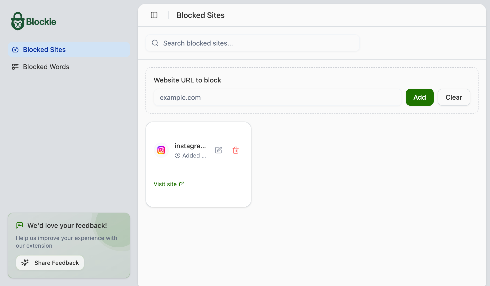
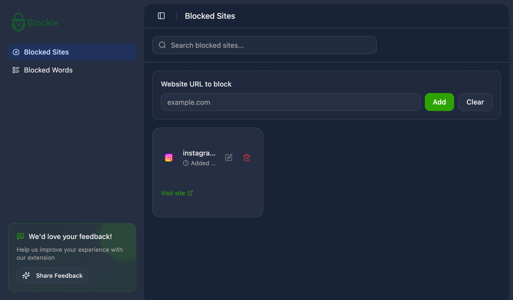

# Blockie | Block Websites & Be Productive

Blockie is a browser extension built with WXT and React, designed to help you stay focused and productive by blocking distracting websites.

## ✨ Features

*   **Website Blocking:** Easily add websites to your blocklist.
*   **Productivity Focus:** Minimize distractions and reclaim your time.
*   **Customizable:** (Assuming some level of customization, common for such tools)
*   **Light & Dark Mode:** Supports both light and dark themes for comfortable viewing.

## 📸 Screenshots

**Light Mode:**

**Dark Mode:**

## 🚀 Tech Stack

*   **WXT:** Next-gen framework for creating cross-browser extensions.
*   **React:** JavaScript library for building user interfaces.
*   **Tailwind CSS:** A utility-first CSS framework for rapid UI development.
*   **TypeScript:** Typed superset of JavaScript.
*   **Radix UI:** Unstyled, accessible UI components.
*   **Zustand:** Small, fast and scalable bearbones state-management solution.
*   **Dexie.js:** A wrapper for IndexedDB for client-side storage.

## 🛠️ Development

This template should help get you started developing with React in WXT.